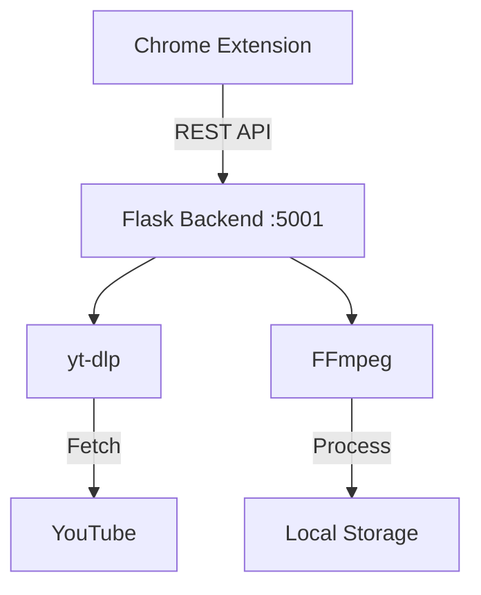

<h1 align="center">🚀 YT Downloader</h1>

<p align="center">
  
</p>

<div align="center">

[](https://www.python.org/)
[]()
[]()
[](LICENSE)

</div>

A high-performance **Chrome extension** and **Flask backend** suite designed for seamless YouTube media extraction. Download videos and playlists directly to your local storage with automated metadata tagging and high-fidelity quality control.

> [!IMPORTANT]
> **For personal use only.** Please respect YouTube's [Terms of Service](https://www.youtube.com/t/terms) and only download content you have the right to access.

---
## How It Works

- A **Chrome extension** (Manifest V3) provides a popup UI for the current YouTube tab.
- A **Flask backend** (`app.py`) runs locally on `http://localhost:5001`, handling downloads via `yt-dlp` and post-processing via `ffmpeg`.
- The extension communicates with the backend over HTTP. Downloaded files are saved to the `downloads/` folder.

## ✨ Core Features

| Feature                 | Description                                                              |
| :---------------------- | :----------------------------------------------------------------------- |
| 🎵 **Audio Mastering**  | MP3 export with selectable bitrates (128k, 192k, 320k).                  |
| 🎬 **Video Quality**    | MP4 support from 720p up to **4K Ultra HD**.                             |
| 🖼️ **Smart Tagging**    | Automatic ID3 metadata injection and square-cropped cover art embedding. |
| 📋 **Batch Processing** | Full playlist support with asynchronous downloading and ZIP archiving.   |
| ✏️ **Manual Overrides** | Direct control over Title and Artist fields before processing starts.    |

---

## 🛠️ System Requirements

| Requirement      | Command to Install         |
| :--------------- | :------------------------- |
| **Python 3.14+** | `brew install python@3.14` |
| **FFmpeg 8.0**   | `brew install ffmpeg@8`    |

---

## 🚀 Quick Start

### 1. Repository Setup

```bash
git clone https://github.com/Misterscan/download-yt.git
cd download-yt
```

### 2. Virtual Environment

```bash
# MacOS
python3 -m venv .venv
source .venv/bin/activate
pip install -r backend/requirements.txt
```
```powershell
# Windows
python -m venv venv
.\venv\Scripts\Activate.ps1
pip install -r backend/requirements.txt
```

### 3. Chrome Extension

1. Navigate to `chrome://extensions/` in Chrome.
2. Enable **Developer mode** (top-right).
3. Click **Load unpacked** and select the `extension/` directory.

---

## 💻 Architecture Overview

The system operates as a client-server architecture localized to your machine for maximum privacy and speed:

- **Frontend**: A Chrome Extension (Manifest V3) providing a dynamic UI and YouTube page integration.
- **Backend**: A Flask-based Python API leveraging `yt-dlp` and `FFmpeg` for media processing.
- **Persistence**: Managed via local server execution.


## Project Structure

```text
download-yt/
├── backend/                 # Flask server
│   ├── app.py               # Main API and logic
│   ├── requirements.txt     # Python dependencies
│   └── downloads/           # Output directory for media
├── extension/               # Chrome Extension
│   ├── manifest.json        # Extension configuration
│   ├── popup.html           # Extension UI structure
│   ├── popup.js             # Extension UI logic
│   └── logo.png             # Extension icon
├── README.md                # Project documentation
├── CONTRIBUTING.md          # Contribution guidelines
└── LICENSE                  # MIT License
```
---

## 📡 API Endpoints

| Method | Endpoint | Description |
|--------|----------|-------------|
| `GET` | `/health` | Health check |
| `GET` | `/info?url=<url>` | Fetch video/playlist metadata |
| `POST` | `/download` | Download a single video |
| `POST` | `/playlist/start` | Start an async playlist download job |
| `GET` | `/playlist-status/<job_id>` | Poll playlist job progress |
| `GET` | `/file/<filename>` | Retrieve a downloaded file |

---
## Notes

- The backend must be running before using the extension.
- Duplicate filenames are automatically numbered (e.g., `Song (2).mp3`).

---

## 📄 Legal & Contribution

- **License**: Distributed under the [MIT License](LICENSE).
- **Contributing**: Please review [CONTRIBUTING](CONTRIBUTING.md) for development standards.
